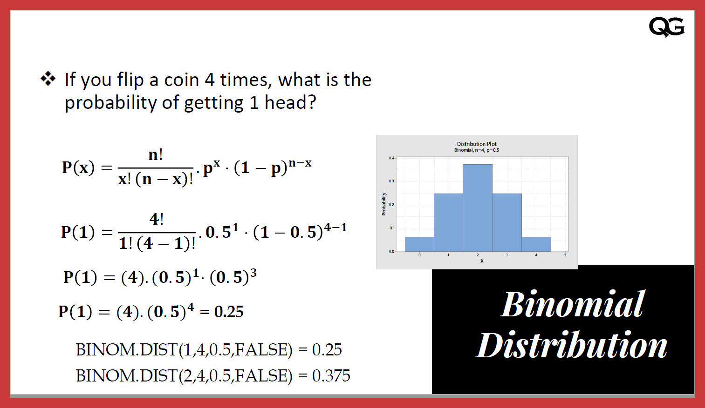

# Binomial test
26-03-2023

Binomial: the sum or the difference of two terms

## Problem:
Is the binary conclusion drawn from this sample generalisable to the overall population? 

## Assumption 

## Applicable on:
1. Binary outcomes: Success vs failed, yes or no
2. small sample size.

## Steps:
1. Declare the null hypothesis (in comparision to the alternative hypothesis)  where the statement is true, e.g. "the experiment is a success", "the coin has head up" 
2. Collect the sample and calculate the probablity of null hypothesis being true. 
3. If p very small, reject null, and conclude "the observed potion of success is significantly different from the hypothesized value"

## Use cases:
1. "Is this medical treatment effective"
2. "Is product A more popular than product B"
3. "does the product meet the standards"

## How to represent the results
We found males are more pain-intolerant. (Sample size: 100. Binomial test p < 0.05. 95% IC 0.2-0.7)
- Conclusion
- null hypothesis and alternative hypothesis
- number of success and sample size
- p value
- confidence interval, e,g. 95% IC
 

## Keywords:
`Null hypothesis`, `Binomial distribution`, `alternative hypothesis`
